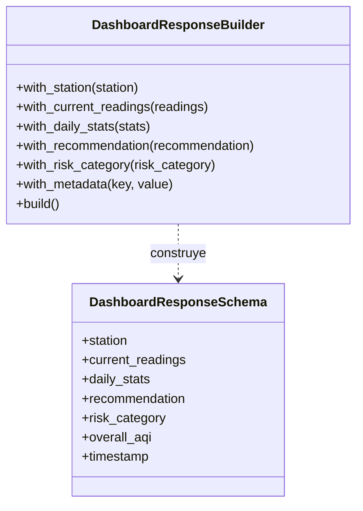

# Patrón Builder aplicado al Dashboard de Calidad del Aire

Este documento explica, de forma simple y sin tecnicismos, cómo el patrón Builder ayuda a construir respuestas complejas del dashboard en este proyecto.

## ¿Qué problema resuelve?

Imagina que tienes que mostrar un dashboard completo con información de calidad del aire. Este dashboard necesita combinar muchos datos diferentes:
- Información de la estación
- Lecturas actuales de contaminantes
- Estadísticas diarias
- Recomendaciones de salud
- Categoría de riesgo
- Y otros datos adicionales

Si intentas crear todo esto de una sola vez, el código se vuelve complicado, difícil de leer y propenso a errores. Además, no siempre necesitas todos los datos: a veces quieres solo algunas partes.

El patrón Builder permite construir estas respuestas complejas **paso a paso**, de forma ordenada y flexible.

## Idea en pocas palabras

- Tienes un "constructor" (Builder) que te ayuda a armar una respuesta compleja pieza por pieza.
- Cada método del constructor añade una parte específica (estación, lecturas, estadísticas, etc.).
- Los métodos se pueden encadenar (uno tras otro) de forma elegante.
- Al final, llamas a `build()` y obtienes la respuesta completa.
- Puedes agregar solo las partes que necesitas, sin tener que llenar todo.

## Participantes y su papel (sin jerga)

- **Builder (DashboardResponseBuilder)**: Es el constructor que te ayuda a armar la respuesta paso a paso. Tiene métodos para agregar cada tipo de información.
- **Product (DashboardResponseSchema)**: Es el objeto final que se construye. Contiene todos los datos del dashboard organizados.
- **Director (implícito en el endpoint)**: Es el código que usa el builder y decide qué partes agregar. En nuestro caso, es el endpoint `/api/air-quality/dashboard`.

## Diagrama de Clases



## Ejemplo simple (explicado de forma llana)

Imagina que un usuario quiere ver el dashboard:

1. **Crear el constructor**: Se crea un `DashboardResponseBuilder` vacío.

2. **Agregar piezas paso a paso**:
   ```python
   builder = DashboardResponseBuilder()
   builder.with_station(estacion)           # Agrega info de la estación
   builder.with_current_readings(lecturas)  # Agrega lecturas actuales
   builder.with_daily_stats(estadisticas)   # Agrega estadísticas
   builder.with_recommendation(recomendacion) # Agrega recomendación
   builder.with_risk_category(categoria)    # Agrega categoría de riesgo
   ```

3. **Construir la respuesta final**:
   ```python
   respuesta_completa = builder.build()
   ```

4. **Ventaja del encadenamiento** (fluent interface):
   ```python
   respuesta = (DashboardResponseBuilder()
       .with_station(estacion)
       .with_current_readings(lecturas)
       .with_daily_stats(estadisticas)
       .with_recommendation(recomendacion)
       .with_risk_category(categoria)
       .build())
   ```

## ¿Por qué usamos Builder en nuestra aplicación?

### Problema real que resolvemos:

Nuestro dashboard de calidad del aire necesita mostrar:
- **Datos de la estación** (nombre, ubicación)
- **Lecturas en tiempo real** de múltiples contaminantes (PM2.5, PM10, O3, etc.)
- **Estadísticas históricas** (promedios, máximos, mínimos)
- **Recomendaciones personalizadas** basadas en el nivel de AQI
- **Categoría de riesgo** (Bueno, Moderado, Dañino, etc.)
- **Metadatos adicionales** (hora de actualización, advertencias, etc.)

Sin el patrón Builder, tendríamos que:
- Crear un constructor gigante con muchos parámetros (difícil de usar)
- O tener muchos constructores diferentes para distintas combinaciones (código repetido)
- O usar diccionarios y listas sin estructura clara (propenso a errores)

### Ventajas concretas en nuestro proyecto:

1. **Flexibilidad**: No siempre necesitamos todos los datos. A veces solo queremos mostrar las lecturas actuales sin estadísticas históricas. El builder permite construir solo lo que necesitas.

2. **Código limpio y legible**: 
   ```python
   # Fácil de leer y entender
   dashboard = (builder
       .with_station(station)
       .with_current_readings(readings)
       .build())
   ```

3. **Cálculos automáticos**: El builder calcula automáticamente el AQI general cuando agregas las lecturas. No tienes que recordar hacerlo manualmente.

4. **Validación centralizada**: El método `build()` verifica que la respuesta tenga sentido antes de devolverla.

5. **Fácil de extender**: Si mañana necesitamos agregar pronósticos o comparaciones, solo agregamos un método `with_forecast()` al builder.

6. **Consistencia**: Todas las respuestas del dashboard siguen la misma estructura, sin importar qué datos incluyan.

## Ventajas generales del patrón

- **Construcción paso a paso**: No tienes que proporcionar todos los datos de una vez.
- **Código más legible**: Los métodos encadenados leen como una oración en inglés.
- **Reutilizable**: Puedes usar el mismo builder para crear diferentes versiones de la respuesta.
- **Mantenible**: Si necesitas cambiar cómo se construye la respuesta, solo modificas el builder.
- **Testeable**: Cada método del builder se puede probar de forma independiente.

## Cuándo usar Builder

- Cuando necesitas construir objetos complejos con muchas partes opcionales.
- Cuando el proceso de construcción involucra múltiples pasos.
- Cuando quieres que el código de construcción sea más legible.
- Cuando el objeto final tiene muchas configuraciones posibles.

## Cuándo NO usar Builder

- Para objetos simples con pocos campos (usa el constructor normal).
- Si no hay variaciones en la construcción (todos los objetos se crean igual).
- Si no necesitas validaciones o cálculos durante la construcción.

## Dónde está en nuestro proyecto

- **Builder**: `app/services/dashboard_service/builder.py`
- **Uso principal**: Endpoint `GET /api/air-quality/dashboard` en `app/api/v1/endpoints/air_quality.py`
- **Producto construido**: `DashboardResponseSchema`

## Flujo de uso en la aplicación

1. Usuario hace petición GET a `/api/air-quality/dashboard?station_id=1`
2. El endpoint crea un `DashboardResponseBuilder()`
3. Consulta la base de datos para obtener:
   - Información de la estación
   - Lecturas actuales
   - Estadísticas diarias
4. Usa otros servicios para obtener:
   - Recomendación (Factory Pattern)
   - Categoría de riesgo (Strategy Pattern)
5. Agrega cada parte al builder con métodos `with_*()`
6. Llama a `build()` para obtener la respuesta completa
7. FastAPI serializa y envía la respuesta al usuario

## Relación con otros patrones

En nuestra aplicación, Builder trabaja junto con otros patrones:

- **Strategy Pattern**: Builder llama al servicio de categorización de riesgo que usa Strategy para determinar la categoría.
- **Factory Pattern**: Builder llama al servicio de recomendaciones que usa Factory para crear la recomendación apropiada.
- **Prototype Pattern**: Las configuraciones del dashboard pueden ser clonadas usando Prototype.

Esto demuestra cómo los patrones de diseño trabajan juntos para crear una aplicación bien estructurada.

---

## Resumen ejecutivo

**Builder** nos permite construir respuestas complejas del dashboard de forma ordenada, flexible y mantenible. En lugar de crear todo de una vez, lo hacemos paso a paso, agregando solo las partes que necesitamos. Esto hace que el código sea más fácil de leer, probar y modificar.

