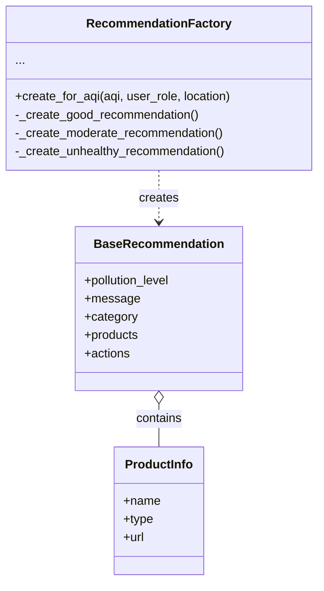

# Patrón Factory aplicado a Recomendaciones de Calidad del Aire

Este documento explica, de forma simple y sin tecnicismos, cómo el patrón Factory ayuda a crear recomendaciones personalizadas basadas en la calidad del aire en este proyecto.

## ¿Qué problema resuelve?

Imagina que tienes que dar recomendaciones de salud a las personas según qué tan contaminado esté el aire. Dependiendo del nivel de contaminación (AQI), las recomendaciones son completamente diferentes:

- **Aire bueno (AQI 0-50)**: "Disfruta actividades al aire libre"
- **Aire moderado (AQI 51-100)**: "La mayoría puede hacer actividades normales"
- **Dañino para sensibles (AQI 101-150)**: "Grupos sensibles deben limitar actividades"
- **Dañino (AQI 151-200)**: "Todos deben evitar actividades prolongadas"
- **Muy dañino (AQI 201-300)**: "Alerta de salud - quédate en casa"
- **Peligroso (AQI 301+)**: "EMERGENCIA - no salgas bajo ninguna circunstancia"

Si mezclas toda esta lógica en un solo lugar, el código se vuelve un desastre de `if-else` difícil de mantener. Además, cada nivel necesita:
- Un mensaje diferente
- Productos recomendados específicos (mascarillas, purificadores, etc.)
- Acciones concretas a tomar
- Contexto adicional según el rol del usuario (ciudadano, investigador, administrador)

El patrón Factory **centraliza la creación de estas recomendaciones complejas** en un solo lugar, decidiendo qué tipo de recomendación crear según el nivel de AQI.

## Idea en pocas palabras

- Tienes una "fábrica" (Factory) que sabe crear recomendaciones.
- Le das el nivel de AQI y el contexto (rol del usuario, ubicación).
- La fábrica decide qué tipo de recomendación crear (buena, moderada, dañina, etc.).
- Te devuelve una recomendación completa con mensaje, productos y acciones.
- El cliente no necesita saber cómo se crean las recomendaciones, solo las usa.

## Participantes y su papel (sin jerga)

- **Factory (RecommendationFactory)**: Es la fábrica que crea recomendaciones. Tiene un método público `create_for_aqi()` que decide qué tipo de recomendación hacer según el AQI.

- **Product (BaseRecommendation)**: Es el objeto que se crea. Contiene toda la información de la recomendación: nivel de contaminación, mensaje, categoría, productos recomendados y acciones a tomar.

- **Concrete Products (métodos privados)**: Son los métodos internos que crean cada tipo específico de recomendación:
  - `_create_good_recommendation()` - Para aire bueno
  - `_create_moderate_recommendation()` - Para aire moderado
  - `_create_unhealthy_sensitive_recommendation()` - Para grupos sensibles
  - `_create_unhealthy_recommendation()` - Para aire dañino
  - `_create_very_unhealthy_recommendation()` - Para aire muy dañino
  - `_create_hazardous_recommendation()` - Para emergencias

- **Components (ProductInfo)**: Son objetos auxiliares que representan productos recomendados (mascarillas, purificadores, monitores).

## Diagrama de Clases



## Ejemplo simple (explicado de forma llana)

Imagina que un usuario consulta el estado del aire en Bogotá y el AQI es 180 (dañino):

1. **El endpoint llama a la fábrica**:
   ```python
   factory = RecommendationFactory()
   recommendation = factory.create_for_aqi(
       aqi=180,
       user_role="Citizen",
       location="Bogota"
   )
   ```

2. **La fábrica evalúa el AQI**:
   - ¿Es 180 <= 50? No
   - ¿Es 180 <= 100? No
   - ¿Es 180 <= 150? No
   - ¿Es 180 <= 200? **Sí** → Usar `_create_unhealthy_recommendation()`

3. **Crea la recomendación específica**:
   ```python
   # Mensaje personalizado
   message = "Air quality in Bogota is unhealthy (AQI: 180)"
   
   # Productos recomendados
   products = [
       ProductInfo(name="N95 Respirator Mask", type="respirator"),
       ProductInfo(name="HEPA Air Purifier", type="air_purifier"),
       ProductInfo(name="Indoor Air Quality Monitor", type="monitor")
   ]
   
   # Acciones a tomar
   actions = [
       "Avoid prolonged outdoor activities",
       "Wear N95 mask if you must go outside",
       "Keep windows and doors closed",
       "Run air purifiers on high"
   ]
   ```

4. **Devuelve la recomendación completa**:
   ```python
   return BaseRecommendation(
       pollution_level=180,
       message=message,
       category="unhealthy",
       products=products,
       actions=actions
   )
   ```

5. **El usuario recibe una recomendación lista para usar**, sin saber cómo se creó.

## ¿Por qué usamos Factory en nuestra aplicación?

### Problema real que resolvemos:

Nuestro sistema de calidad del aire necesita proporcionar recomendaciones que:
- **Varían dramáticamente** según el nivel de AQI (6 niveles diferentes)
- **Incluyen productos específicos** para cada nivel (desde ninguno hasta equipos de emergencia)
- **Se personalizan por rol** (ciudadanos, investigadores, administradores)
- **Contienen acciones concretas** apropiadas para cada situación
- **Deben ser fáciles de actualizar** cuando cambien las guías de salud

Sin Factory, tendríamos:
- Un método gigante con muchos `if-elif-else` anidados (difícil de leer)
- Lógica de creación mezclada con lógica de negocio (difícil de mantener)
- Duplicación de código entre niveles similares
- Dificultad para agregar nuevos niveles o modificar existentes

### Ventajas concretas en nuestro proyecto:

1. **Centralización**: Toda la lógica de creación de recomendaciones está en un solo lugar. Si necesitas cambiar las recomendaciones para AQI dañino, sabes exactamente dónde ir.

2. **Facilidad de lectura**: 
   ```python
   # Claro y simple
   recommendation = RecommendationFactory.create_for_aqi(aqi=180, ...)
   
   # vs código sin Factory (ejemplo simplificado):
   if aqi <= 50:
       if user_role == "Researcher":
           message = "..."
       else:
           message = "..."
       products = []
       actions = [...]
   elif aqi <= 100:
       # ... mucho más código repetido
   ```

3. **Personalización por rol**: La fábrica agrega contexto específico:
   - **Investigadores**: Reciben información técnica adicional
   - **Administradores**: Reciben alertas para tomar acción pública
   - **Ciudadanos**: Reciben consejos prácticos

4. **Productos dinámicos**: Cada nivel incluye productos apropiados:
   - **AQI 0-100**: Sin productos
   - **AQI 101-150**: Mascarillas básicas y monitores
   - **AQI 151-200**: Respiradores N95 y purificadores HEPA
   - **AQI 201-300**: Equipos de protección avanzados
   - **AQI 301+**: Equipos profesionales y kits de evacuación

5. **Fácil de extender**: 
   - ¿Nueva guía de la OMS? Agrega un método nuevo
   - ¿Nuevo producto recomendado? Actualiza un método específico
   - ¿Nueva categoría de AQI? Agrega un método y actualiza la lógica de decisión

6. **Testeable**: Cada método de creación se puede probar independientemente:
   ```python
   # Test unitario simple
   recommendation = factory._create_unhealthy_recommendation(180, "Citizen", "Bogota")
   assert recommendation.category == "unhealthy"
   assert len(recommendation.products) >= 3
   ```

## Ventajas generales del patrón

- **Encapsulación**: Oculta la complejidad de creación de objetos
- **Flexibilidad**: Fácil agregar nuevos tipos de productos
- **Mantenibilidad**: Cada tipo de recomendación tiene su propio método
- **Reutilización**: La fábrica puede usarse desde múltiples endpoints
- **Consistencia**: Todas las recomendaciones siguen la misma estructura

## Cuándo usar Factory

- Cuando no sabes de antemano qué tipo exacto de objeto crear (depende de datos en tiempo de ejecución)
- Cuando tienes varios tipos relacionados de objetos que se crean de forma similar
- Cuando la lógica de creación es compleja y no quieres mezclarla con el resto del código
- Cuando quieres centralizar la creación para facilitar mantenimiento

## Cuándo NO usar Factory

- Para objetos simples que no varían (usa el constructor directamente)
- Si solo hay un tipo de objeto (no necesitas abstracción)
- Si la lógica de creación es trivial (una o dos líneas)

## Dónde está en nuestro proyecto

- **Factory**: `app/services/recommendation_service/factory.py`
- **Modelos**: `app/services/recommendation_service/models.py`
  - `BaseRecommendation` - Producto creado
  - `ProductInfo` - Componente de productos
- **Uso principal**: Endpoint `GET /api/recommendations/current` en `app/api/v1/endpoints/recommendations.py`

## Flujo de uso en la aplicación

1. Usuario hace petición GET a `/api/recommendations/current?station_id=1`
2. El endpoint obtiene el AQI actual de la estación
3. Llama a `RecommendationFactory.create_for_aqi(aqi, user_role, location)`
4. La fábrica:
   - Evalúa el AQI
   - Llama al método privado apropiado
   - Crea los ProductInfo necesarios
   - Genera el mensaje personalizado
   - Define las acciones recomendadas
5. Retorna un `BaseRecommendation` completo
6. FastAPI serializa y envía la respuesta al usuario

## Ejemplo real de uso

```python
# En el endpoint
from app.services.recommendation_service.factory import RecommendationFactory

@router.get("/current")
def get_current_recommendation(station_id: int, current_user: User):
    # Obtener AQI actual
    aqi = air_quality_service.get_current_aqi(station_id)
    station = station_repository.get_by_id(station_id)
    
    # Usar la fábrica para crear recomendación
    recommendation = RecommendationFactory.create_for_aqi(
        aqi=aqi,
        user_role=current_user.role,
        location=station.name
    )
    
    return recommendation
```

**Resultado para AQI = 180 (Ciudadano en Bogotá)**:
```json
{
  "pollution_level": 180,
  "message": "Air quality in Bogota is unhealthy (AQI: 180). Everyone may experience health effects.",
  "category": "unhealthy",
  "products": [
    {
      "name": "N95 Respirator Mask",
      "type": "respirator",
      "url": "https://example.com/n95"
    },
    {
      "name": "HEPA Air Purifier",
      "type": "air_purifier",
      "url": "https://example.com/purifier"
    },
    {
      "name": "Indoor Air Quality Monitor",
      "type": "monitor",
      "url": "https://example.com/monitor"
    }
  ],
  "actions": [
    "Avoid prolonged outdoor activities",
    "Wear N95 mask if you must go outside",
    "Keep windows and doors closed",
    "Run air purifiers on high",
    "Sensitive groups should stay indoors"
  ]
}
```

## Relación con otros patrones

En nuestra aplicación, Factory trabaja junto con otros patrones:

- **Strategy Pattern**: Factory puede usar Strategy para decidir qué productos recomendar según diferentes criterios (presupuesto, disponibilidad regional, etc.).

- **Builder Pattern**: El dashboard usa Builder para ensamblar la recomendación creada por Factory junto con otros datos.

- **Prototype Pattern**: Las configuraciones de productos recomendados podrían clonarse usando Prototype para personalización rápida.

## Comparación con otros patrones de creación

### Factory vs Constructor directo
```python
# Sin Factory (difícil de mantener)
if aqi <= 50:
    rec = BaseRecommendation(pollution_level=aqi, message="...", ...)
elif aqi <= 100:
    rec = BaseRecommendation(pollution_level=aqi, message="...", ...)
# ... muchos elif más

# Con Factory (limpio y mantenible)
rec = RecommendationFactory.create_for_aqi(aqi, user_role, location)
```

### Factory vs Builder
- **Factory**: Crea objetos completos de diferentes tipos en un solo paso
- **Builder**: Construye un objeto complejo paso a paso con múltiples configuraciones

Ambos resuelven problemas diferentes y pueden trabajar juntos.

## Niveles de AQI y Recomendaciones

| Rango AQI | Categoría | Productos | Acciones Principales |
|-----------|-----------|-----------|---------------------|
| 0-50 | Good | Ninguno | Disfruta actividades al aire libre |
| 51-100 | Moderate | Ninguno | Actividades normales para la mayoría |
| 101-150 | Unhealthy for Sensitive | Mascarillas básicas, Monitores | Grupos sensibles limiten actividades |
| 151-200 | Unhealthy | Respiradores N95, Purificadores HEPA | Evitar actividades prolongadas |
| 201-300 | Very Unhealthy | Respiradores N95/N99, Purificadores profesionales | Permanecer en interiores |
| 301+ | Hazardous | Respiradores P100, Equipos hospitalarios | EMERGENCIA: No salir |

---

## Resumen ejecutivo

**Factory** nos permite crear recomendaciones personalizadas de forma centralizada y mantenible. En lugar de tener lógica compleja esparcida por el código, la fábrica decide qué tipo de recomendación crear según el nivel de AQI, y genera automáticamente el mensaje, productos y acciones apropiadas para cada situación. Esto hace que el código sea más limpio, fácil de probar y simple de actualizar cuando cambien las guías de salud pública.

