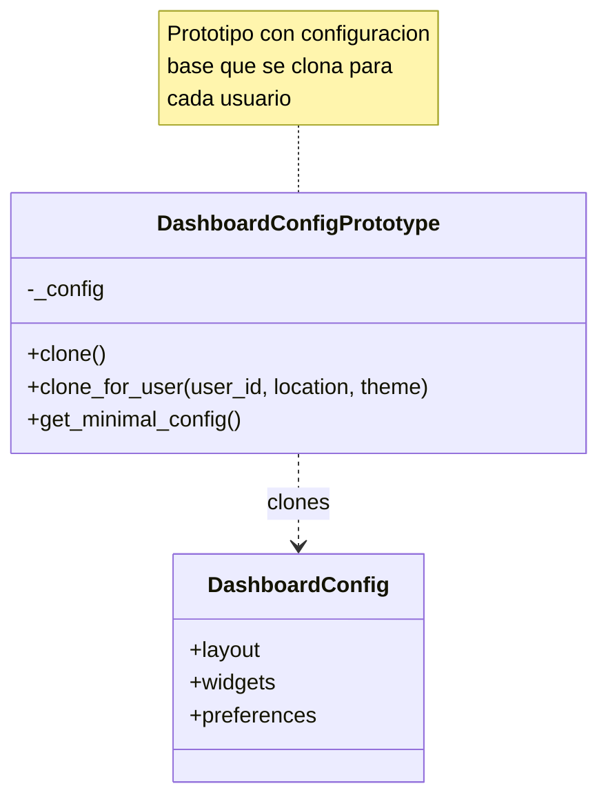

# Patrón Prototype aplicado a Configuraciones de Dashboard

Este documento explica, de forma simple y sin tecnicismos, cómo el patrón Prototype ayuda a crear configuraciones personalizadas de dashboard en este proyecto.

## ¿Qué problema resuelve?

Imagina que cada usuario de tu aplicación de calidad del aire necesita un dashboard personalizado. Este dashboard tiene muchas configuraciones:

- **Layout** (disposición de elementos)
- **Widgets** (gráficos, mapas, alertas, recomendaciones)
  - Cada widget tiene posición, tamaño y configuraciones propias
- **Intervalo de actualización** (cada cuánto se refrescan los datos)
- **Preferencias del usuario** (ubicación predeterminada, estaciones favoritas, tema visual)

Si tuvieras que crear toda esta configuración desde cero para cada usuario, sería:
- **Lento**: Muchas líneas de código para inicializar cada campo
- **Propenso a errores**: Fácil olvidar configurar algo
- **Difícil de mantener**: Si cambias la configuración predeterminada, tienes que actualizar múltiples lugares

El patrón Prototype permite **clonar una configuración base** y luego personalizarla según las necesidades del usuario. Es como tener una plantilla que puedes copiar y modificar.

## Idea en pocas palabras

- Tienes un "prototipo" (configuración base) con valores predeterminados sensatos.
- Cuando necesitas una nueva configuración, **clonas el prototipo** en lugar de crearlo desde cero.
- Luego personalizas el clon según el usuario (ubicación, tema, etc.).
- Cada clon es independiente - modificar uno no afecta a otros ni al original.

## Participantes y su papel (sin jerga)

- **Prototype (DashboardConfigPrototype)**: Es la configuración base que se puede clonar. Contiene valores predeterminados sensatos para todos los usuarios.

- **Métodos de clonación**:
  - `clone()` - Crea una copia exacta de la configuración base
  - `clone_for_user()` - Crea una copia y la personaliza para un usuario específico
  - `get_minimal_config()` - Crea una versión simplificada (ideal para móviles)

- **Clon (DashboardConfig)**: Es la copia independiente que se personaliza. Cada usuario tiene su propia copia.

- **Cliente (Endpoint)**: El código que solicita una configuración, la obtiene clonada y la guarda/retorna al usuario.

## Diagrama de Clases



## Ejemplo simple (explicado de forma llana)

### Escenario 1: Usuario nuevo necesita dashboard predeterminado

```python
# Obtener el prototipo global
from app.services.dashboard_service.prototype import default_dashboard_prototype

# Clonar la configuración base
config = default_dashboard_prototype.clone()

# Ahora 'config' es una copia independiente con:
# - 5 widgets (AQI, gráfico de contaminantes, recomendaciones, mapa, alertas)
# - Actualización cada 5 minutos
# - Tema claro
# - Sin ubicación predeterminada
```

### Escenario 2: Usuario existente con preferencias personalizadas

```python
# Clonar y personalizar en un solo paso
config = default_dashboard_prototype.clone_for_user(
    user_id=123,
    default_location="Bogota",
    theme="dark"
)

# Ahora 'config' tiene:
# - Todos los widgets base
# - user_id = 123
# - default_location = "Bogota"
# - theme = "dark"
```

### Escenario 3: Usuario en móvil necesita versión simplificada

```python
# Obtener configuración mínima
config = default_dashboard_prototype.get_minimal_config()

# Ahora 'config' tiene:
# - Solo 2 widgets esenciales (AQI y recomendaciones)
# - Layout "minimal"
# - Menos datos para transferir y renderizar
```

## ¿Por qué usamos Prototype en nuestra aplicación?

### Problema real que resolvemos:

Nuestra aplicación de calidad del aire tiene un dashboard complejo con:
- **5 widgets diferentes** (cada uno con múltiples configuraciones)
- **Posiciones y tamaños** específicos para cada widget
- **Preferencias de usuario** (ubicación, estaciones favoritas, tema)
- **Múltiples versiones** (completa, mínima, personalizada)

Sin Prototype, tendríamos que:
```python
# Código repetitivo y propenso a errores (MALO)
def create_dashboard_config(user_id):
    config = {
        "layout": "default",
        "refresh_interval": 300,
        "widgets": [
            {
                "id": "current-aqi",
                "type": "aqi-display",
                "position": {"row": 0, "col": 0, "width": 2, "height": 2},
                "settings": {"show_color": True, "show_trend": True}
            },
            # ... repetir esto para cada widget
            # ... 50+ líneas de código repetido
        ],
        "preferences": {
            "default_location": None,
            "favorite_stations": [],
            "theme": "light"
        }
    }
    return config
```

Con Prototype:
```python
# Limpio y simple (BUENO)
config = default_dashboard_prototype.clone_for_user(
    user_id=user_id,
    default_location=user.location,
    theme=user.theme
)
```

### Ventajas concretas en nuestro proyecto:

1. **Configuración consistente**: Todos los usuarios empiezan con la misma configuración base bien probada.

2. **Personalización fácil**: Clonas y modificas solo lo que necesitas.

3. **Múltiples variantes**:
   - Completa: `clone()` - Para desktop
   - Personalizada: `clone_for_user()` - Con preferencias del usuario
   - Mínima: `get_minimal_config()` - Para móviles

4. **Rendimiento**: 
   - Clonar es más rápido que construir desde cero
   - `copy.deepcopy()` es una operación optimizada en Python

5. **Mantenibilidad**:
   - Cambias la configuración base en un solo lugar
   - Todos los clones futuros heredan los cambios
   - No necesitas actualizar múltiples funciones

6. **Versionamiento**:
   - Fácil ofrecer diferentes "plantillas" (v1, v2, minimal, pro)
   - Cada plantilla es un prototipo diferente

## Ventajas generales del patrón

- **Reduce duplicación**: No repites código de inicialización
- **Independencia**: Cada clon es independiente del original
- **Flexibilidad**: Clonar y modificar es más fácil que construir desde cero
- **Rendimiento**: Clonar puede ser más rápido que crear (especialmente con objetos complejos)
- **Variaciones fáciles**: Un prototipo puede generar múltiples variantes

## Cuándo usar Prototype

- Cuando tienes objetos complejos con muchos campos que se inicializan de forma similar
- Cuando necesitas crear múltiples variantes de una configuración base
- Cuando la construcción desde cero es costosa o complicada
- Cuando quieres evitar subclases para cada variante

## Cuándo NO usar Prototype

- Para objetos simples con pocos campos (usa el constructor)
- Si no necesitas clonar (cada instancia es única)
- Si la clonación es más compleja que la construcción directa
- Si los objetos tienen referencias circulares complejas (difícil de clonar)

## Dónde está en nuestro proyecto

- **Prototype**: `app/services/dashboard_service/prototype.py`
- **Clase**: `DashboardConfigPrototype`
- **Instancia global**: `default_dashboard_prototype`
- **Uso principal**: Endpoints en `app/api/v1/endpoints/settings.py`

## Flujo de uso en la aplicación

### Endpoint: GET /api/settings/dashboard

```python
@router.get("/dashboard")
def get_dashboard_config(current_user: User = Depends(get_current_user)):
    """
    Obtener configuración de dashboard del usuario.
    Si no existe, crea una desde el prototipo.
    """
    # Buscar configuración existente en BD
    existing_config = settings_repository.get_user_dashboard_config(current_user.id)
    
    if existing_config:
        return existing_config
    
    # No existe, clonar desde prototipo
    new_config = default_dashboard_prototype.clone_for_user(
        user_id=current_user.id,
        default_location=current_user.default_location,
        theme=current_user.preferred_theme or "light"
    )
    
    # Guardar en BD
    settings_repository.save_dashboard_config(current_user.id, new_config)
    
    return new_config
```

### Endpoint: GET /api/settings/dashboard/minimal

```python
@router.get("/dashboard/minimal")
def get_minimal_dashboard_config():
    """
    Obtener configuración mínima para dispositivos móviles.
    No requiere autenticación.
    """
    return default_dashboard_prototype.get_minimal_config()
```

## Ejemplo real de configuración

### Configuración Base (Prototipo)

```json
{
  "layout": "default",
  "refresh_interval": 300,
  "widgets": [
    {
      "id": "current-aqi",
      "type": "aqi-display",
      "position": {"row": 0, "col": 0, "width": 2, "height": 2},
      "settings": {
        "show_color": true,
        "show_trend": true
      }
    },
    {
      "id": "pollutants-chart",
      "type": "chart",
      "position": {"row": 0, "col": 2, "width": 4, "height": 2},
      "settings": {
        "chart_type": "line",
        "time_range": "24h",
        "pollutants": ["PM2.5", "PM10", "O3"]
      }
    },
    {
      "id": "recommendations",
      "type": "recommendations",
      "position": {"row": 2, "col": 0, "width": 3, "height": 2},
      "settings": {
        "show_products": true,
        "max_items": 5
      }
    },
    {
      "id": "map",
      "type": "map",
      "position": {"row": 2, "col": 3, "width": 3, "height": 2},
      "settings": {
        "zoom_level": 10,
        "show_stations": true,
        "show_heat_map": true
      }
    },
    {
      "id": "alerts",
      "type": "alerts",
      "position": {"row": 4, "col": 0, "width": 2, "height": 1},
      "settings": {
        "show_active_only": true
      }
    }
  ],
  "preferences": {
    "default_location": null,
    "favorite_stations": [],
    "theme": "light"
  }
}
```

### Configuración Personalizada (después de `clone_for_user()`)

```json
{
  "user_id": 123,
  "layout": "default",
  "refresh_interval": 300,
  "widgets": [ /* ... mismo que arriba ... */ ],
  "preferences": {
    "default_location": "Bogota",
    "favorite_stations": [],
    "theme": "dark"
  }
}
```

### Configuración Mínima (después de `get_minimal_config()`)

```json
{
  "layout": "minimal",
  "refresh_interval": 300,
  "widgets": [
    {
      "id": "current-aqi",
      "type": "aqi-display",
      "position": {"row": 0, "col": 0, "width": 2, "height": 2},
      "settings": {
        "show_color": true,
        "show_trend": true
      }
    },
    {
      "id": "recommendations",
      "type": "recommendations",
      "position": {"row": 2, "col": 0, "width": 3, "height": 2},
      "settings": {
        "show_products": true,
        "max_items": 5
      }
    }
  ],
  "preferences": {
    "default_location": null,
    "favorite_stations": [],
    "theme": "light"
  }
}
```

## Relación con otros patrones

En nuestra aplicación, Prototype trabaja junto con otros patrones:

- **Builder Pattern**: Builder puede usar Prototype como punto de partida para construir respuestas de dashboard. Por ejemplo, clonar la configuración base y luego usar Builder para agregar datos en tiempo real.

- **Strategy Pattern**: Los widgets individuales podrían usar Strategy para renderizarse de diferentes formas según el dispositivo.

- **Factory Pattern**: Factory podría crear diferentes tipos de prototipos (BasicPrototype, PremiumPrototype, MobilePrototype).

## Prototype vs Builder vs Factory

### ¿Cuándo usar cada uno?

| Patrón | Cuándo usarlo | Ejemplo en nuestra app |
|--------|---------------|------------------------|
| **Prototype** | Tienes una configuración base compleja que se clona y personaliza | Configuraciones de dashboard |
| **Builder** | Construyes objetos paso a paso con muchas opciones | Respuestas de API complejas |
| **Factory** | Creas diferentes tipos de objetos según criterios | Recomendaciones según AQI |

### Prototype vs Builder

```python
# Prototype: Clonar y modificar
config = prototype.clone_for_user(user_id=123, theme="dark")
config["widgets"].append(new_widget)  # Modificar después

# Builder: Construir paso a paso
response = (builder
    .with_station(station)
    .with_readings(readings)
    .build())
```

**Prototype** es mejor cuando:
- Tienes una plantilla completa que se copia
- Las modificaciones son menores
- Quieres múltiples variantes de lo mismo

**Builder** es mejor cuando:
- Construyes desde cero con muchas opciones
- El orden de construcción importa
- Quieres interfaz fluida (encadenamiento)

## Deep Copy: El corazón del Prototype

En Python, Prototype usa `copy.deepcopy()` para clonar:

```python
def clone(self) -> Dict[str, Any]:
    return copy.deepcopy(self._config)
```

### ¿Por qué Deep Copy?

```python
# Shallow copy (MALO para objetos anidados)
import copy
original = {"widgets": [{"id": "1"}]}
shallow = copy.copy(original)
shallow["widgets"][0]["id"] = "2"
print(original["widgets"][0]["id"])  # "2" - ¡MODIFICÓ EL ORIGINAL!

# Deep copy (BUENO)
deep = copy.deepcopy(original)
deep["widgets"][0]["id"] = "3"
print(original["widgets"][0]["id"])  # "2" - Original intacto
```

Deep copy crea copias independientes de todos los objetos anidados (listas, diccionarios, objetos).

## Widgets del Dashboard

### Tipos de Widgets

| Tipo | Descripción | Datos que muestra |
|------|-------------|-------------------|
| **aqi-display** | Indicador grande de AQI | AQI actual con color y categoría |
| **chart** | Gráfico de tendencias | Histórico de contaminantes |
| **recommendations** | Lista de recomendaciones | Acciones y productos sugeridos |
| **map** | Mapa interactivo | Estaciones y mapa de calor |
| **alerts** | Alertas activas | Notificaciones de calidad del aire |

### Configuración de Widget

Cada widget tiene:
- **id**: Identificador único
- **type**: Tipo de widget
- **position**: Ubicación en grid (row, col, width, height)
- **settings**: Configuraciones específicas del tipo

## Casos de Uso Reales

### 1. Usuario nuevo se registra
```python
# Crear configuración inicial
config = default_dashboard_prototype.clone_for_user(
    user_id=new_user.id,
    default_location=new_user.city,
    theme="light"
)
db.save(config)
```

### 2. Usuario móvil solicita dashboard
```python
# Retornar versión ligera
config = default_dashboard_prototype.get_minimal_config()
return config
```

### 3. Usuario premium quiere más widgets
```python
# Clonar y agregar widgets extra
config = default_dashboard_prototype.clone_for_user(user_id, location, theme)
config["widgets"].append({
    "id": "forecast",
    "type": "forecast",
    "position": {"row": 5, "col": 0, "width": 6, "height": 2}
})
```

### 4. Actualizar configuración base para todos
```python
# Modificar el prototipo
default_dashboard_prototype._config["refresh_interval"] = 600  # 10 min

# Todos los clones futuros usarán 10 min
# Los clones existentes no se ven afectados (son copias independientes)
```

## Rendimiento

### Comparación: Construcción vs Clonación

```python
import time
import copy

# Construcción manual (más lento)
start = time.time()
for i in range(1000):
    config = {
        "layout": "default",
        "widgets": [/* ... 50 líneas ... */],
        # ... resto de la configuración
    }
construction_time = time.time() - start

# Clonación desde prototipo (más rápido)
prototype = DashboardConfigPrototype()
start = time.time()
for i in range(1000):
    config = prototype.clone()
clone_time = time.time() - start

print(f"Construcción: {construction_time:.3f}s")
print(f"Clonación: {clone_time:.3f}s")
# Clonación suele ser 2-3x más rápida
```

---

## Resumen ejecutivo

**Prototype** nos permite crear configuraciones de dashboard personalizadas de forma eficiente y consistente. En lugar de construir cada configuración desde cero (50+ líneas de código repetido), clonamos un prototipo base bien probado y personalizamos solo lo que necesita cambiar. Esto hace que el código sea más limpio, mantenible y rápido, mientras asegura que todos los usuarios empiecen con una configuración consistente y funcional.

### Key Takeaways

✅ **Clona en lugar de construir** - Más rápido y menos propenso a errores
✅ **Deep copy garantiza independencia** - Los clones no afectan al original
✅ **Múltiples variantes fáciles** - `clone()`, `clone_for_user()`, `get_minimal_config()`
✅ **Configuración consistente** - Todos empiezan con la misma base
✅ **Fácil de mantener** - Cambias el prototipo una vez, afecta a todos los clones futuros

