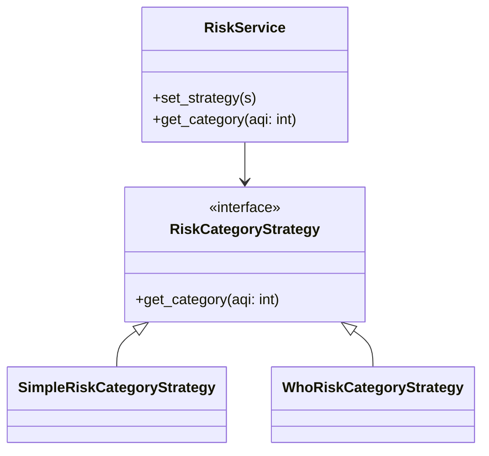

# Patrón Strategy aplicado a la categorización de riesgo (AQI)

Este documento explica, de forma simple y sin tecnicismos, cómo el patrón Strategy ayuda a decidir la categoría de riesgo del aire (AQI) en este proyecto.

## ¿Qué problema resuelve?
Imagina que tienes que decirle a la gente cómo de peligroso está el aire según el valor AQI. Dependiendo de la normativa (por ejemplo, la EPA o la OMS) los rangos y los mensajes cambian. Si esa lógica está mezclada en todo el código, cada vez que quieras usar otra normativa tendrás que tocar muchos sitios y puedes romper cosas.

El patrón Strategy permite separar esas reglas en trozos independientes (estrategias) que puedes cambiar sin tocar el resto del programa.

## Idea en pocas palabras
- Tienes un "decisor" (Context) que sabe pedir una categoría según un valor AQI.
- Ese decisor no contiene las reglas; en lugar de eso, delega la decisión a una "estrategia".
- Cada estrategia implementa una forma distinta de categorizar (EPA, WHO, u otras).
- Puedes cambiar la estrategia en tiempo de ejecución, sin modificar el decisor.

## Participantes y su papel (sin jerga)
- Context (aquí: RiskService): Es quien necesita la respuesta ("¿qué categoría corresponde a este AQI?"). No tiene las reglas fijas; llama a la estrategia que tenga asignada.
- Strategy (interfaz: RiskCategoryStrategy): Es la promesa de que cualquier estrategia sabrá dar una categoría (RiskCategory) para un valor AQI.
- ConcreteStrategy (ejemplos): `SimpleRiskCategoryStrategy` (usa los rangos estándar EPA) y `WhoRiskCategoryStrategy` (usa los rangos más estrictos de la OMS). Cada una contiene solo su lógica de rangos.
- Cliente: Es quien decide qué estrategia usar y la asigna al Context. Por ejemplo, la configuración del servicio o una llamada que cambia la política.

## Diagrama (Mermaid)

## Ejemplo simple (explicado de forma llana)
- El servicio recibe el número AQI.
- El `RiskService` pregunta a la estrategia usando `get_category(aqi)`: "¿qué categoría corresponde a este AQI?".
- La estrategia mira sus rangos (por ejemplo: <=50 = "Good"), devuelve un objeto `RiskCategory` con el nivel, etiqueta, color y descripción.
- Si mañana queremos usar la tabla de la OMS en lugar de la EPA, creamos o seleccionamos la estrategia WHO y la asignamos al `RiskService` — todo lo demás sigue funcionando igual.

## Ventajas (por qué es útil)
- Cambiar reglas sin tocar el resto del código: mínimo riesgo de errores.
- Probar varias reglas fácilmente (útil para pruebas y A/B testing).
- Código más ordenado: cada estrategia sólo tiene la lógica que le corresponde.
- Facilita agregar nuevas normativas en el futuro.

## Cuándo usarlo
- Cuando tengas diferentes algoritmos (o reglas) que resuelvan el mismo problema y quieras poder intercambiarlos.
- Cuando quieras mantener el core de la aplicación independiente de políticas concretas.

## Cuándo no es necesario
- Si solo hay una única regla que nunca cambiará, usar Strategy añade estructura innecesaria.

## Dónde están las clases en este proyecto
- Ruta del "contexto" y servicios: `app/services/risk_category/`
- Estrategias concretas esperadas:
  - `SimpleRiskCategoryStrategy` (rangos EPA)
  - `WhoRiskCategoryStrategy` (rangos WHO)

También puedes revisar el diagrama de flujo de rangos en `docs/strategy/diagrama_de_flujo.mmd` para ver cómo se toman las decisiones dentro de una estrategia.

---
Si quieres, puedo:
- Generar un `.mmd` separado con este diagrama en estilo gráfico, o
- Hacer una versión aún más corta para ponerla en la documentación pública (README).
Dime qué prefieres.

